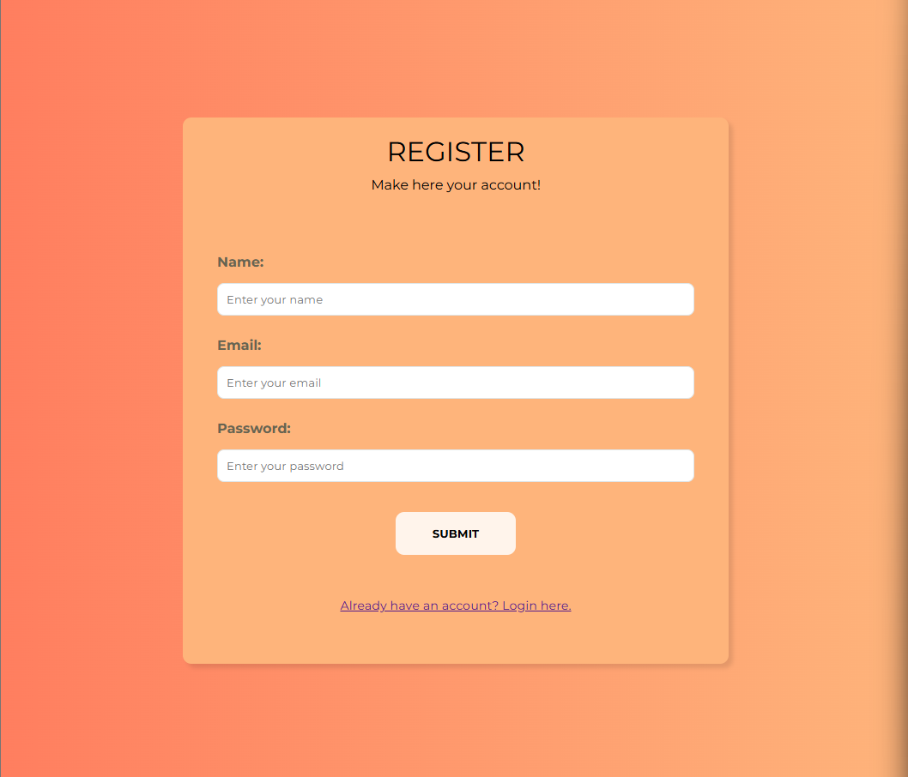

<h2>
  Aplicação full-stack de <b>autenticação de usuários</b> desenvolvida com
  Node.js + Express no back-end e React no front-end.
</h2>

<h3>
  O projeto implementa um sistema completo de registro e login com validações,
  tokens JWT e persistência em banco de dados.
</h3>

  

<h2>Funcionalidades Implementadas:</h2>
<ul>
  <li>Sistema de registro de novos usuários com validação de dados</li>
  <li>Login seguro com verificação de credenciais</li>
  <li>Geração e validação de tokens JWT para autenticação</li>
  <li>Hash de senhas utilizando bcrypt para segurança</li>
  <li>Persistência de dados em banco de dados</li>
  <li>Interface responsiva para login e registro</li>
  <li>Armazenamento do token para manter sessão</li>
</ul>

<h2>Tecnologias Utilizadas:</h2>
<ul>
  <li>
    <b>Back-End:</b> Node.js, Express, TypeScript, bcrypt, JSON Web Tokens (JWT)
  </li>
  <li><b>Front-End:</b> React, requisições HTTP com fetch/axios</li>
  <li><b>Segurança:</b> Hash de senhas, tokens JWT, validação de entrada</li>
  <li><b>Arquitetura:</b> Padrão MVC com separação de concerns</li>
</ul>

<h3>
  O projeto demonstra técnicas de desenvolvimento full-stack com foco em
  segurança, arquitetura escalável e boas práticas de autenticação.
</h3>

  Desenvolvido com ❤️ por <b>Davi Teles de Moraes</b> - Contribuições são
  bem-vindas!

